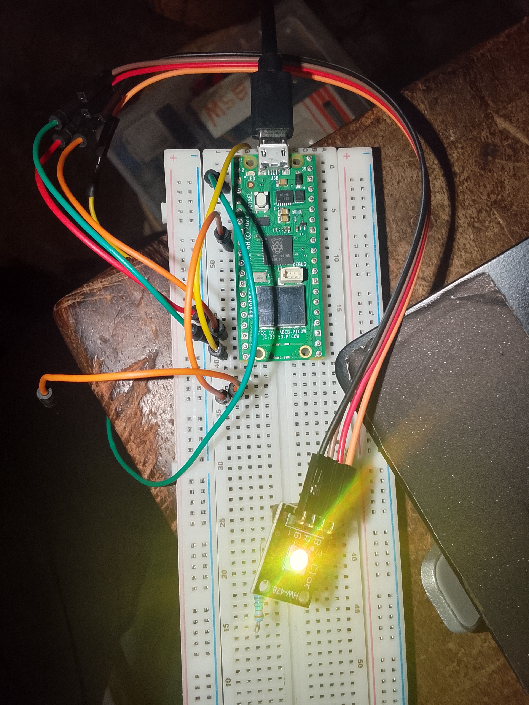

# RGB LED Sequential Fade Effect Using Raspberry Pi Pico W

This project demonstrates how to create a sequential fade effect using an RGB LED and the Raspberry Pi Pico W. The brightness of the red, green, and blue channels gradually increases one after another using PWM, creating a smooth lighting animation.

## Components Used

* Raspberry Pi Pico W
* RGB LED Module
* Breadboard
* Jumper Wires

## Programming Language

* MicroPython

## Features

* PWM-based brightness control
* Sequential RGB fading effect
* Smooth light transitions
* Automatic repeating animation
* Function-based program structure

## Project Code

[Click here to check out the project code](code/RGB_Illumination_Controller_using_while_loop.py)

## Project images

## Project Demo Video

[Click here to check out the project Demo Video](https://youtu.be/pWSDFGOyhd8?si=guXsQ_Deg59-LOVo)

## Pin Connections

* Red Pin → GP13
* Green Pin → GP14
* Blue Pin → GP15

## How It Works

The program gradually increases the brightness of each RGB LED channel in sequence.

* The red channel fades from OFF to full brightness.
* The green channel then fades from OFF to full brightness.
* The blue channel finally fades from OFF to full brightness.
* After all channels reach maximum brightness, the RGB LED remains ON briefly.
* The LED is then turned OFF and the sequence repeats.

This creates a smooth RGB lighting animation using Pulse Width Modulation (PWM).

## Author

Moses Olorunfemi Kolawole
